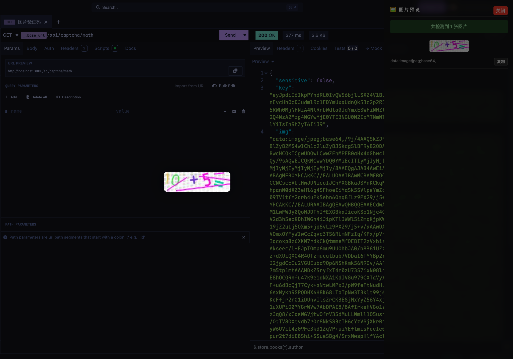

# 🖼️ insomnia-plugin-image-preview

一个用于 [Insomnia](https://insomnia.rest/) 的插件，用于自动提取和预览接口响应中的图片。它会在侧边弹出预览面板，展示所有可识别的图片地址，并提供图片放大、复制链接等功能，提升调试体验。

---

## 🚀 功能特色

- ✅ 自动解析 JSON 响应体中的图片链接
- ✅ 支持深度遍历并识别常见图片字段名（如 `image`, `url`, `avatar`, `thumbnail`, 等）
- ✅ 支持 base64 图片和网络地址（`http`, `https`, `data:`）
- ✅ 图片预览窗口右侧弹出，不遮挡主窗口内容
- ✅ 单击图片可放大，支持滚轮缩放
- ✅ 一键复制图片地址到剪贴板
- ✅ 支持最大递归深度限制，防止无限循环

---

## 📦 安装方式（手动安装）

> 插件尚未发布到插件市场，请手动安装：

### 1. 克隆插件代码

```bash
git clone git@github.com:Jwlmn/insomnia-plugin-image-preview.git
```

---

### 2. 将插件放入 Insomnia 插件目录

| 操作系统       | 插件目录路径                                     |
| -------------- | ------------------------------------------------ |
| 🪟 **Windows** | `%APPDATA%\Insomnia\plugins`                     |
| 🍎 **macOS**   | `~/Library/Application Support/Insomnia/plugins` |
| 🐧 **Linux**   | `~/.config/Insomnia/plugins`                     |

#### Windows 安装步骤

1. 按 `Win + R`，输入 `%APPDATA%\Insomnia\plugins` 并回车
2. 将插件文件夹复制进去（例如：`insomnia-plugin-image-preview`）
3. 最终目录应为：

   ```
   %APPDATA%\Insomnia\plugins\insomnia-plugin-image-preview
   ```

#### macOS 安装步骤

```bash
mkdir -p ~/Library/Application\ Support/Insomnia/plugins
cp -r insomnia-plugin-image-preview ~/Library/Application\ Support/Insomnia/plugins/
```

#### Linux 安装步骤

```bash
mkdir -p ~/.config/Insomnia/plugins
cp -r insomnia-plugin-image-preview ~/.config/Insomnia/plugins/
```

---

### 3. 重启 Insomnia

完成后请关闭并重新打开 Insomnia，即可生效。

---

## 🧠 使用说明

1. 启动 Insomnia，发送一个返回 JSON 的请求。
2. 若 JSON 中包含图片链接字段（如 `img`, `imageUrl`, `avatar`, `src`, `url` 等），插件会自动在右侧弹出一个 **图片预览面板**。
3. 每张图片下方显示其 URL（或 base64 的简略头部），点击“复制”按钮即可将 URL 复制到剪贴板。
4. 点击图片可放大查看，支持滚轮缩放，点击背景关闭。

---

## 🧪 支持字段（自动识别）

插件默认支持识别以下字段名中的图片链接：

```js
[
  "img",
  "image",
  "images",
  "imageUrl",
  "thumbnail",
  "avatar",
  "photo",
  "picture",
  "icon",
  "logo",
  "url",
  "src",
  "cover",
  "background",
];
```

字段名中**包含上述关键词即可匹配**（不区分大小写）。

---

## ⚙️ 技术细节

- 最大递归解析深度：5
- 支持 `Buffer`、字符串、或对象形式的 JSON 响应体
- 支持从 `res.getBodyBuffer()`、`res.getBody()` 或 `res.body` 获取响应内容
- 在响应 `Content-Type` 包含 `"application/json"` 时才触发插件功能

---

## 🛠️ 开发与调试

插件结构基于 `responseHooks`，自动挂载于响应生命周期中：

```js
module.exports = {
  responseHooks: [
    async ({ response }) => {
      if (!response.getHeader("content-type")?.includes("application/json"))
        return;
      const html = await processImages(response);
      if (html) setTimeout(() => createPreviewWindow(html), 100);
    },
  ],
};
```

---

## 🧩 兼容性

- ✅ 支持 Insomnia Core 与 Designer
- ⚠️ 仅支持 JSON 响应体（非 JSON 将跳过处理）
- ⚠️ 插件不会修改原始响应内容，仅用于增强预览体验

---

## 📸 效果截图


